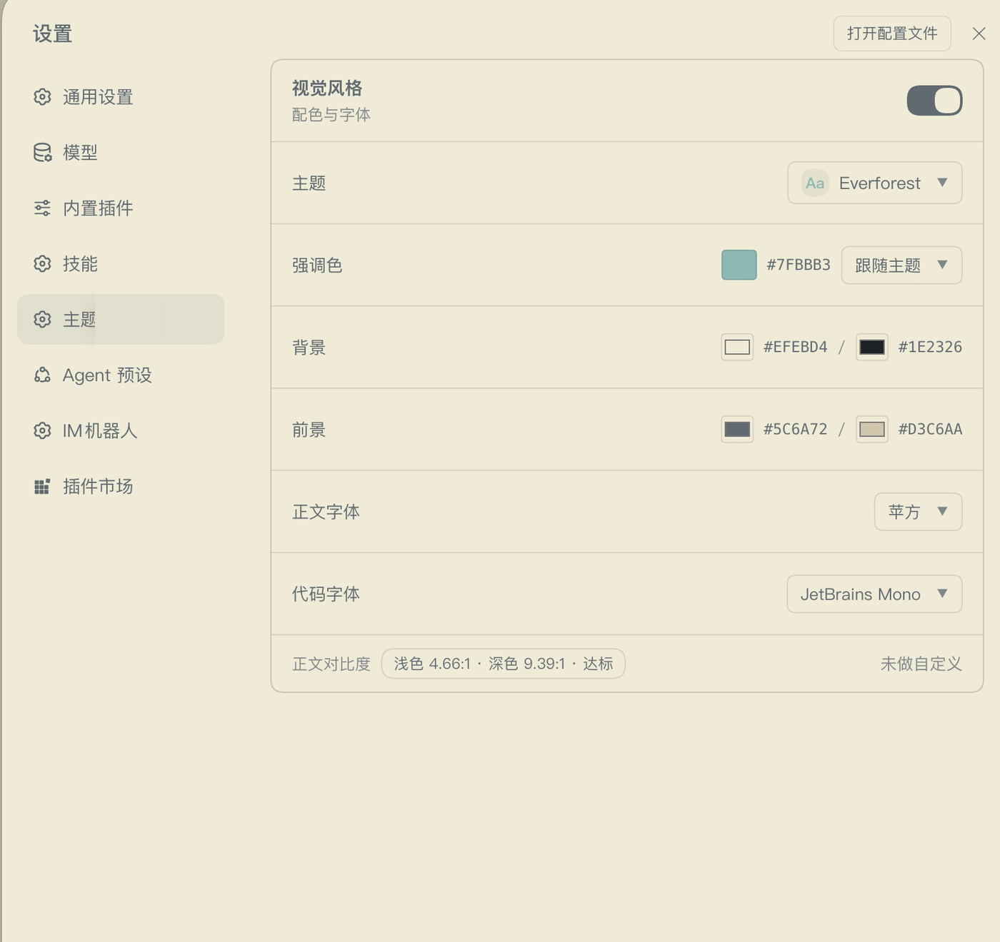

# dsh-theme-native

**A small, native theme plugin for the DeepSeek Harness Web GUI.**

10 presets, custom colors, and system font pickers. It uses the Harness theme and settings extension points, reuses the host layout, and does not patch the application shell.

> Community software. This project is not affiliated with, sponsored by, or endorsed by DeepSeek.


## Preview




## Compatibility

- DSH Desktop / Web: `0.1.7-rc.2` and `0.2.0-rc.1`
- Last verified: September 29, 2026
- Package: `dsh-theme-native@0.1.2`

## Install

From DSH Desktop, install it through **Settings → Plugin Market** after the package is listed in the community catalog.

For a local bundle, use the official plugin manager with the absolute path to the installable `plugin/` package:

```text
plugin_manager action=install_bundle target=/path/to/dsh-theme-native/plugin
```

Do not edit the profile manifest by hand. After installation, open **Settings → Theme**.

After the npm package is published, install the exact released version through the official plugin manager:

```text
plugin_manager action=install_bundle target=dsh-theme-native@0.1.2
```

On DSH Desktop, use **Settings → Plugin Market** after the community catalog entry is available. Remove the old local development bundle before installing the npm version so both copies do not mount together.

## Features

- 10 presets: Flexoki, Catppuccin, Gruvbox, Everforest, GitHub, Nord, Rosé Pine, Kanagawa, Modus, and Atom One
- Accent, light background, dark background, light foreground, and dark foreground controls
- Body and code font pickers that list only fonts detected on the current machine
- Theme enable/disable switch and a contrast readout for light and dark surfaces
- Keyboard accessible dropdowns and color controls
- One click to clear custom colors without changing the selected preset

## Native by design

- Uses `ctx.theme.overrideTokens` for the color layer.
- Uses `ctx.slots.inject` for the settings section.
- Reads React from the Harness browser module table; it does not install a second React copy.
- Does not import Harness Client primitive packages.
- Does not replace the app root, take over routing, or write a second app into `document.body`.
- Ships no font files and has no runtime network request.

The runtime client is about 54 KB. The complete bundle is about 57 KB unpacked and has no regular runtime dependencies.

## Privacy

The plugin does not read credentials, send telemetry, or make network requests. UI preferences are stored in the Web page's local storage. Font detection measures local canvas text widths and does not upload the result.

## Verification

Run from the repository root:

```bash
node tools/emit-plugin.mjs
node tools/verify-runtime.mjs
node tools/verify-manifest.mjs
node tools/simulate-client.mjs
```

The checks cover generated-client freshness, token shape, contrast invariants, bundle metadata, loader identity, and one simulated settings render. GitHub Actions runs the same checks on pushes and pull requests.

## Development notes

`presets.json` stores source anchors. `tools/lib/ramp.mjs` and `tools/lib/ladder.mjs` derive the token ramps for both the build checks and the shipped client. The local extraction scripts can refresh those anchors from a DSH installation and a local theme collection; they are maintainer tools and are not needed to install the plugin.

The installable package lives in `plugin/`. The repository root contains the generator, verification tools, screenshots, and design references so changes remain reproducible and reviewable. The community catalog entry targets `plugin/` as a monorepo subpackage.

## Uninstall

Remove the bundle through the same official plugin manager. Removing it disposes the override layer and returns the interface to the DSH appearance.

## Community listing

The plugin is intended for the community [awesome-dsh-plugin](https://github.com/awesome-dsh-plugin/awesome-dsh-plugin) catalog. The ready-to-submit entry is [docs/awesome-dsh-plugin.yml](docs/awesome-dsh-plugin.yml). Catalog inclusion does not imply official DeepSeek endorsement.

## License

MIT. See [LICENSE](LICENSE).
